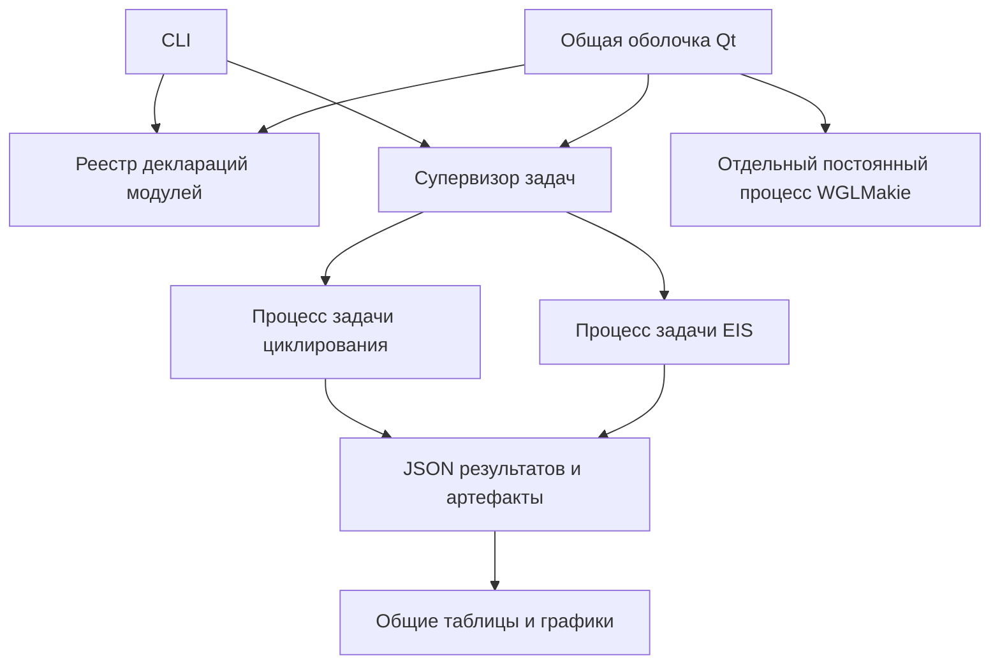

# Архитектура первой версии

## Зависимости

`core` использует только стандартную библиотеку Python. Он не импортирует Qt,
модули, SciPy, NumPy или графические библиотеки. `bootstrap.py` — единственное
место, где приложение выбирает состав модулей. Их декларации легковесны;
вычислительный handler импортируется только внутри отдельного процесса задачи.

Модули EIS и циклирования не импортируют друг друга. Базовая панель GUI строит формы из
`ModuleSpec`/`OptionSpec`, без знания конкретной математики. `core.readers`
содержит общие функции чтения CSV и кодировок; колонки и научные типы данных
определяет модуль. Парсеры одного прибора можно позднее вынести в общий пакет IO.

Для нового модуля: создать легковесный `ModuleSpec`, указать actions/handler,
описать настройки, зарегистрировать его в composition root. Handler принимает
`JobRequest, JobContext` и возвращает JSON-совместимый payload. Не передавать
QObject, объекты оптимизатора, исполняемые функции или большие массивы в ответ.
Большие данные сохранять через `context.artifact`; графики описывать через PlotSpec.

## Рабочие панели модулей

Приложение использует одно главное окно. Выбор модуля расположен в верхнем тулбаре;
`QStackedWidget` показывает его рабочую панель. Переключение не запускает и не
отменяет задачи, не пересоздаёт панель и сохраняет настройки, результаты и вид графиков.
Команды тулбара относятся к активному модулю. Общий журнал задач скрыт по умолчанию
и открывается отдельной кнопкой.

`desktop.frontends` выбирает интерфейсные адаптеры отдельно от научного реестра.
EIS использует `modules.eis.desktop.EisPanel`: слева данные, скрытые расширенные
настройки, кандидаты схем и журнал; справа графики, параметры, KK и сводка.
Адаптер импортирует Qt и общую панель, но не вычислитель EIS. Базовая `ModulePanel`
предоставляет общие сервисы задач, графиков и экспорта. Cycling использует
`modules.cycling.desktop.CyclingPanel`: опыты слева, выбранные циклы, временные
кривые, метрики и паузы справа. Базовая панель остаётся fallback для декларативных модулей. Ошибка создания специализированной панели
оставляет доступной базовую панель и остальные модули.

EIS позволяет импортировать несколько спектров или папку и рассчитывать выбранный
спектр либо весь список последовательной очередью. Ошибка файла сохраняется
отдельно и не прекращает обработку остальных. Результаты
каждого спектра сохраняются в состоянии панели на время работы приложения.
Импорт (снимок, парсер, KK и подготовка ограниченного превью), расчёт и экспорт
происходят в отдельных задачах. Выбор строки читает уже подготовленное небольшое
JSON-превью. Перенесённые научные функции и сценарии исходного EIS перечислены
в [workflows.md](workflows.md); исследовательские конвейеры доступны через CLI.

Общая команда «Очистить» вызывает `clear_workspace` только активной панели.
Она забывает ссылки и отображаемое состояние; сервис задач, снимки и артефакты
не удаляются. Панели блокируют очистку при `_busy`, а окно — во время работы
с сессией. Поздние события старых задач и Makie не восстанавливают очищенные
данные, поскольку идентификаторы заданий панели сбрасываются.

## Исполнение

На каждую задачу создаётся новый процесс через `spawn`. Общего process pool нет:
аварийное завершение одного процесса не делает исполнитель остальных непригодным.
В десктопе задачи выполняются последовательно: `max_active=1`. Можно переключиться
на другой модуль во время расчёта; новая задача будет ожидать в очереди.
Сам `JobService` сохраняет поддержку нескольких процессов для других сценариев:
его стандартный предел — две задачи, не больше одной задачи каждого модуля.
При таком режиме очередь пропускает занятый модуль, чтобы другой мог начать работу.
Внутренние BLAS/OpenMP потоки ограничиваются до одного на задачу.

Qt вызывает `poll()` через таймер каждые 50 мс. Межпроцессный канал передаёт
короткие события и путь к результату. Получение событий ограничено на один tick.
Долгие импорт, KK, fitting, интегрирование, запись данных и Julia-экспорт выполняются
вне потока интерфейса. На UI остаются взаимодействие, небольшие таблицы и превью.

Состояния: queued → running → succeeded/failed; отмена и таймаут проходят через
cancelling → cancelled/timed_out. На отмену сначала поднимается Event. Через grace
неответивший процесс получает terminate, затем kill. На POSIX задача владеет своей
группой процессов: это позволяет остановить также её внешние вычислители.

Нет обещания полной защиты ОС от произвольного вредоносного плагина или исчерпания
всей памяти. Здесь изолируются ошибки, зависания и native crash доверенного
расчётного кода; память больших задач и системные лимиты — следующий этап.

## Данные и воспроизводимость

Каждая задача имеет отдельную директорию. Источник копируется, вычисляется SHA256;
обработка идёт по копии, исходный файл сохраняется. Изменение размера/mtime во
время копирования считается ошибкой импорта. В result.json сохраняются версия
платформы и модуля, запрос, seed/настройки, зависимости EIS, источники и диагностика.

Результат записывается атомарно и публикуется только при успешном завершении.
Отмена/ошибка не публикует частичные артефакты как готовый результат. Рабочие файлы
неуспешной задачи могут оставаться для диагностики, но result_path отсутствует.
job.json хранит конечное состояние отдельно от научных PASS/WARN/BAD.

## Приёмочные проверки

- Python-ошибка и os._exit(23) в EIS не мешают параллельной задаче циклирования.
- После сбоя запускается следующая задача EIS.
- Отмена некооперативного CPU-цикла и таймаут не останавливают соседний модуль.
- На POSIX отмена останавливает дочерний процесс внешнего вычислителя.
- Qt heartbeat продолжает работать во время CPU-расчёта и сбоя соседней задачи.
- Циклирование работает с Python -S, без site-packages и научных/GUI-зависимостей.
- На уровне ядра реальные EIS и циклирование выполняются одновременно; данные и provenance сохраняются.
- В десктопе задачи выполняются по очереди; переключение модуля сохраняет расчёт и результат.
- Открытие, расчёт и отмена в общем тулбаре обращаются только к активному модулю.
- Контроль канала EIS, направления Im(Z), нерегулярного времени, пауз и неполных циклов.

## Экспорт и локализация

Внутренние действия `load` и модуль `exports` скрыты из списка научных действий.
Экспортный handler вызывает адаптер выбранного модуля (`exporting.py`), загружает
полные артефакты и строит таблицы/графики в worker. `core` знает только журнал
публикации: worker пишет временную соседнюю папку, supervisor переименовывает её
при успехе. Ошибка, авария, отмена или таймаут удаляют временную папку. Существующий
каталог экспорта не заменяется. CSV сохраняет стабильные названия полей и единицы;
язык отчётов и графиков выбирается при экспорте. JSON с включёнными исходниками
имеет пути к копиям внутри комплекта и полные артефакты.

`locale.py` не содержит GUI-зависимостей. Перевод меняет отображаемые подписи,
но не идентификаторы схем, численные поля и настройки расчёта. RU/EN сохраняется
в ui-preferences.json; переключение языка Qt-графиков сохраняет диапазон осей.
Новые запросы Makie получают переведённые подписи отдельно от научного result.json.

## Дополнительные действия EIS

`parameters`, `spice`, `controller` и `research` — скрытые служебные действия EIS.
Обычные режимы анализа видны пользователю. Редактор параметров получает имена, единицы и пределы от worker,
без импорта impedance/NumPy в Qt. Карта настроек задаётся по идентификатору схемы
и отделяется JobService при постановке в очередь. GUI хранит независимые
результаты fit/reliable/statistics/drt для каждого файла; новый импорт инвалидирует
их. Серии и исследования имеют отдельный кеш результатов.

DRT использует копию исходного Solver, с отменой между разбиениями и bootstrap-
итерациями. Неотвечающий SciPy-процесс останавливается супервизором. SPICE
восстанавливает предиктор ECM из версионного JSON и полного spectrum.npz;
QObject/оптимизатор между процессами не передаётся. Проверенный внутренний
комплект копируется в staging общего механизма публикации. ngspice — дочерний
процесс worker, остановка POSIX-группы распространяется на симулятор.

## Кандидаты, пресеты и расширенные проверки

Действия `reliable` и `statistics` используют те же снимки источника и подбор,
что и `fit`, и сохраняют отдельные результаты. Перед интерпретацией строится
контракт исходного `unified_eis_inference`; его правила не подменяются статусом
успешного исполнения задачи. Lin-KK FAIL запрещает рекомендацию. Интервалы
и профиль являются отдельной диагностикой, локальная covariance-ошибка остаётся 1σ.

`fit` сохраняет ограниченные PlotSpec каждого успешного кандидата и полный
`candidates.npz`. Qt выбирает готовые спецификации и строки параметров; он
не импортирует impedance и не пересчитывает отклики. Выбор для просмотра
сохраняется по спектру и режиму, поле `best` и экспорт сохраняют победителя.

Скрытое `presets` проверяет и атомарно сохраняет именованные настройки в
`eis-presets.json` текущего workspace. GUI работает через отдельную задачу;
конфигурация не содержит научных объектов, источников или путей публикации.
Скрытое `import_reliable` принимает пару спектр/полный JSON, снимки обоих
и проверку соответствия до появления успешного результата. Перенос старого
JSON не означает повторного выполнения bootstrap или подтверждения SHA256,
которого не было в старом контракте. Проверки и хеш импортированного отчёта
сохраняются явно.

## Серии, контроллеры и переносимые сессии

`series` агрегирует готовые подборы с исходным объединением BIC и сглаживанием
параметров. Явный CSV с SOC позволяет использовать свои имена файлов. `joint`
подбирает одну заданную топологию по снимкам исходных спектров; проверка
сглаживания оставляет внутренние SOC-спектры вне обучения. Границы вычисляются
для каждого спектра исходным алгоритмом; ручные переопределения в этом режиме
отклоняются явно. Отмена проверяется внутри целевой функции и между подборками.
Совместный подбор не заменяет проверку надёжности схемы или интервалов.

`resolution` выполняет исходную синтетическую двух-RC калибровку обнаружения
медленного пика. Она отделена от решения о реальном образце. `research` имеет
фиксированный каталог функций и разрешённых именованных настроек. Подготовка
корпусов и чтение входов происходят в worker; внешняя папка публикуется общим
атомарным механизмом только после успешного завершения. Значения исходных
производственных порогов не меняются результатами калибровочного эксперимента.

`controller` восстанавливает ECM из result.json и spectrum.npz и вызывает
исходный генератор float32/Q1.31 со строгими проверками КК, модели, частоты
дискретизации и ошибки реализации. Исходный SHA256 сверяется с паспортом.
Ни Julia, ни Qt не участвуют в математике или генерации C.

Скрытый модуль `sessions` — сервис платформы со стандартной библиотекой. GUI
собирает только настройки и ссылки на готовые комплекты. Worker копирует
источники и артефакты, проверяет их SHA256 и пишет session.json версии 1.
Supervisor публикует новую папку. При восстановлении пути ограничены папкой
комплекта, все заявленные файлы проверяются, а состояние показывается только
после успешного задания. JSON не исполняется: сохранённые request/handler не
вызываются. Научные объекты не сериализуются; готовые графики и таблицы берутся
из версионного контракта. Незавершённые задания не входят в сессию.

Восстановленные снимки доступны для нового подбора или смены канала. Совместный
подбор использует восстановленную копию манифеста и карту его источников,
сохраняя исходные имена и SHA256. Численные библиотеки остаются в модуле EIS;
сервис сессий не импортирует их или модуль циклирования.

## Cycling и BioLogic

Cycling 0.2 использует контракт `cycling.run.v2`, стабильные идентификаторы
файл/шаг и длинный `measurements.csv`. Номера прибора и исходные индексы
сохраняются отдельно от номеров анализируемых циклов. Настройка продолжения
файлов выбирается явно; по умолчанию сброс счётчика разделяет циклы.

`analyze` выполняет снимки источников, разбор и интегрирование в worker.
`discover` перечисляет независимые файлы и папки FlowBat без чтения сенсоров.
`view` строит ограниченные графики выбранных циклов и страницы таблиц из
готовых артефактов, сохраняя основной результат расчёта. Фронтенд вызывает
только эти действия и общие сервисы экспорта/сессий; математических импортов
в панели нет. Представления PlotSpec создаются лениво при открытии вкладки.

MPT читается потоково средствами стандартной библиотеки, MPR — через
опциональный `galvani`, импортируемый внутри worker. Пакет `core` не зависит от
BioLogic, Qt или NumPy. Модуль EIS не используется при обработке Cycling.
Общий сервис сессий вызывает интерфейсные hooks, не зная математических
типов Cycling; переносимый комплект содержит снимки всех файлов и config.json.

Разбиение и методы расчёта описаны в [cycling.md](cycling.md). Датчики, камера
и их зависимости отсутствуют. OCV здесь — напряжение конца реальной паузы
самого потенциостата, без внешнего логгера и без оценки полного равновесия.

Supervisor читает ограниченное число событий за один tick. Если worker уже
завершился, оставшийся IPC backlog читается в следующих ticks до терминального
сообщения/EOF; завершение процесса с кодом 0 само по себе не означает успеха.
Это предотвращает ложные ошибки на больших опытах и сохраняет отзывчивость Qt.
